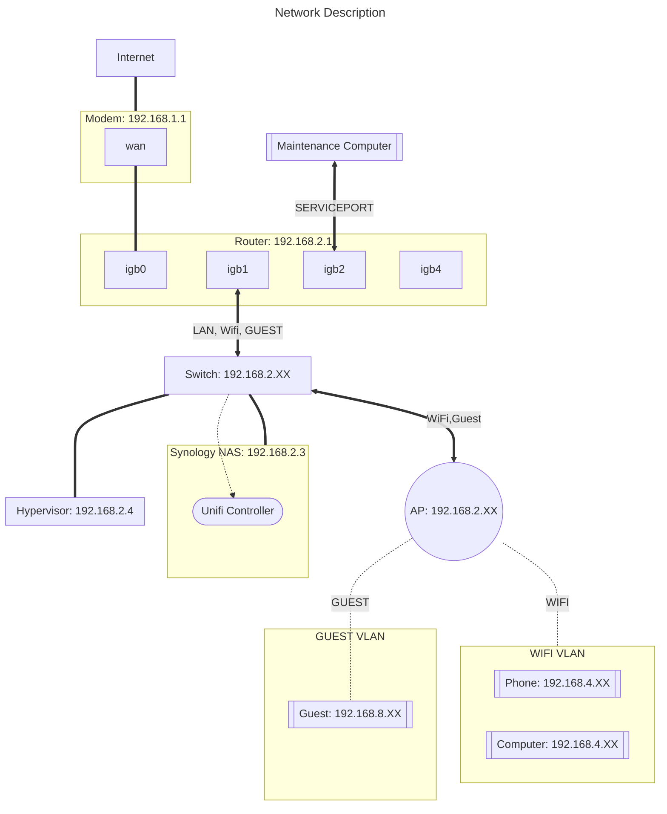

# Network Overview
The `yuvvashankar.net` homelab network comprises 4 main components

0. An internet modem - Teksavvy SmartRG
1. An OPNSense router
2.  a Unifi switch and AP
3.  A Synology NAS
4.  An 4-core Low powered machine

This repository contains a [base_config](../config/opnsense/conf/base_config.xml) which will organize the network in the following manner.

# Rationale
The main idea was to build off of what most household routers default to, 192.168.1.1, each subsequent network tranch is incremented by a power of two. For example, the LAN network is `192.168.2.1`, the WiFi network is `192.168.4.1`, etc etc. 

The network is divided into three segments

1. LAN
2. WiFi
3. GUEST

## LAN

The `LAN` is whatever is connected physically to the network switch. The LAN network is not broadcasted wirelessly. 

## WiFi

The `WiFi` network is a VLAN that connects to trusted devices to the local network. The `WiFi` and `LAN` are allowed to communicated with eachother. This is to enable convenience such as casting to TVs etc. There is a tradeoff wherein one could reconfigure the network if they gain access to the home WiFi network, but it's a tradeoff between security and convenience. I have a personal displeasure in debugging wifi-related issues when I just want to watch something on the television. 

## Guest

The `Guest` network is isolated from communicating with internal RFC1918 IPs. It can only communicate with the internet. Untrusted devices are allowed to connect to this network. 

# Unifi Controller
An unfortunate necissity of using Unifi hardware is the necissity to have a Unifi Controller somewhere on the network. For nothing but convenience reasons, I've chosen to use the Synology NAS's docker utility to run the controller. 

# Important Endpoints
| Endpoint                 | Description               |
| ------------------------ | ------------------------- |
| http://192.168.2.3:5000/ | NAS Endpoint              |
| http://192.168.2.3:8080  | Unifi Endpoint            |
| http://192.168.2.2:8989  | Shows (Sonarr)            |
| http://192.168.2.2:7878  | Movies (Radarr)           |
| http://192.168.2.2:9091  | Downloader (Transmission) |
| http://192.168.2.2:9696  | Prowlarr (Indexer)        |
| http://192.168.2.2:6767  | Bazarr (Subtitles)        |
| http://192.168.2.2:8686  | Lidarr (Music)            |
| http://192.168.2.2:8181  | Tautilli (Notifications)  |

