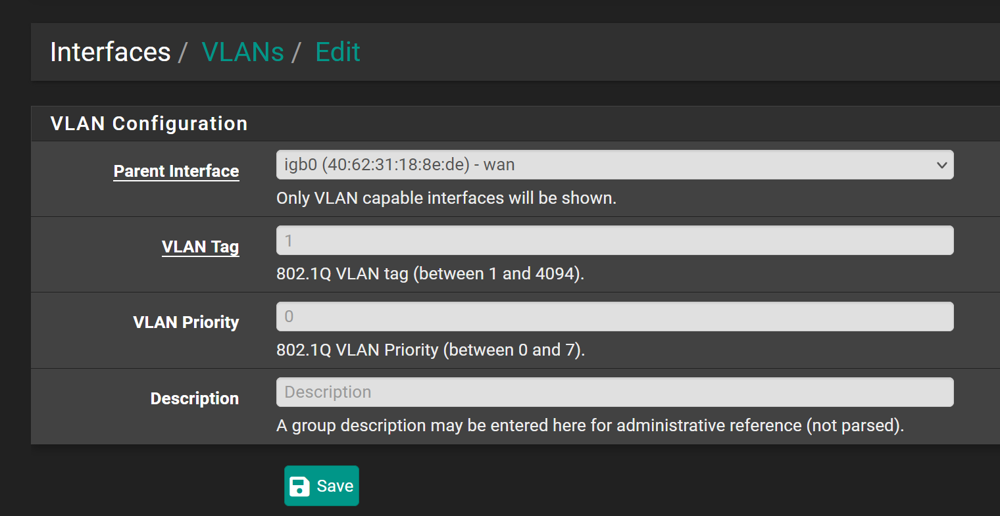
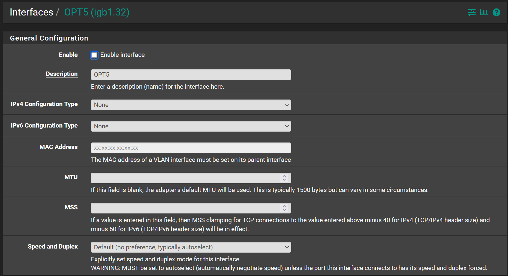
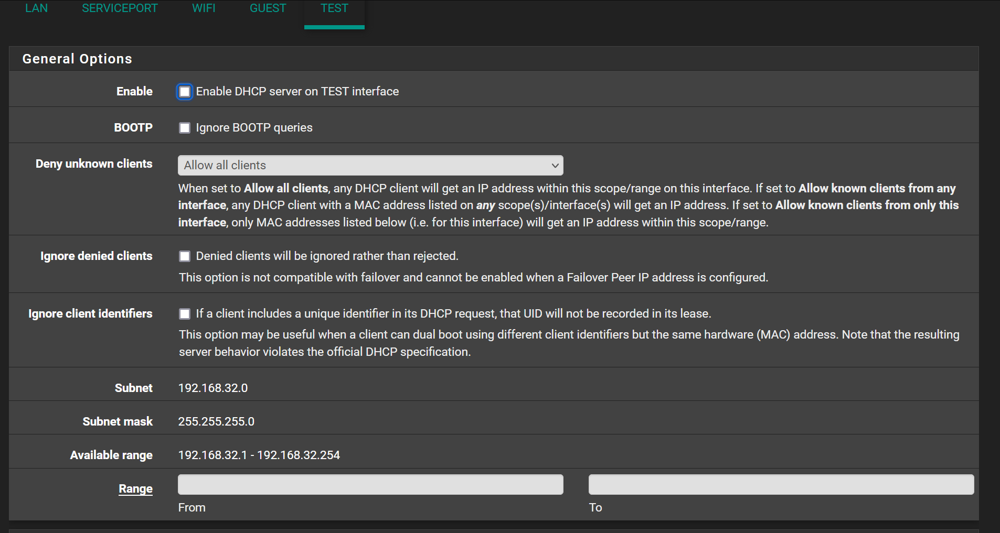

# Setting up a VLAN in pfSense

1. Add a new item under Interfaces -> Assignments -> VLANs

* Parent Interface:  is the wire that the VLAN will be sent over. i.e. (LAN)
* VLAN Tag:  is the unique identifiyer for the VLAN, just make sure it's unique to the other VLANs that exist
* Description: Human readable description of what the VLAN is supposed to segregate.

2. The new VLAN shoudl appear under Interfaces -> Assignments -> Interface Assignments. 

Add the interface to the Interface assignemnts, Click on the new Interface

* Enable the Interface
* Give it a good description
* Give it a static IPv4 address: e.g. `192.168.XX.1` Netmask of `24`. 

3. Setup a DHCP Server under Services -> DHCP Server

* Enable the DHCP Server
* Fill in the IP ranges

4. Test

Go back to Interface Assignments -> VLANs and change the Parent Interface to an un-used Ethernet port on the router e.g. igb3, and test that a commputer is able to connect and get the right IP address on it. 